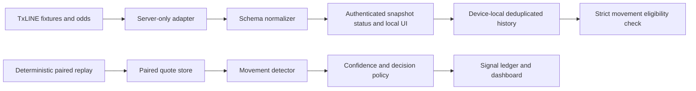

# OddPulse

OddPulse is an autonomous football-odds movement monitor built for the TxODDS
World Cup Hackathon. It turns TxLINE snapshots into auditable evidence and
demonstrates an explainable movement policy in a clearly separated replay.

## Project links

- Source code: [GitHub](https://github.com/guoqiangliu-ocean/oddpulse)
- Demo video: [YouTube walkthrough](https://youtu.be/X7bHzndiUsc)
- Live MVP: pending public deployment

## What it does

- pairs current and baseline quotes from the same provider and exact market line;
- uses fair probability rather than a raw price wherever the full market is known;
- rejects a rogue single-provider move when the provider median remains stable;
- requires directional breadth across matched sources before confirming an alert;
- labels price changes following a score or match-state change separately;
- records the action, confidence, evidence, and virtual or source timestamp;
- runs without human input once the feed is configured.

The included dashboard is fully interactive. An activated Devnet credential now
provides authenticated TxLINE fixture and odds snapshots to the local UI. The
selected fixture is polled every 15 seconds while the tab is visible. Other
explicitly labelled World Cup fixtures are collected one at a time through a
60-second round-robin slot, and deduplicated authenticated snapshots are
retained in device-local IndexedDB.
The signal charts and ledger remain an explicitly labelled, deterministic,
schema-compatible replay because the available history does not yet provide
enough eligible, same-instrument, multi-source pairs for live signal claims.

## Architecture



The browser never receives the TxLINE API token. The server adapter fetches a
short-lived guest JWT, retries once after a `401`, normalizes both documented
field-name variants, and returns only the fields needed by the product.
Local history persists only those normalized public fields. Missing upstream
timestamps remain missing rather than being replaced with local retrieval time.

## Detector policy

The replay detector profile compares quotes 8–60 seconds apart. A candidate must clear
both a fair-probability and log-odds boundary. With multiple matched providers,
at least 67% must move in the same direction. The confidence score combines:

1. movement magnitude;
2. provider breadth;
3. cross-provider dispersion;
4. timestamp and probability quality.

A single-source move receives a larger threshold and cannot exceed 59%
confidence. Spreads and totals are never compared across different lines.

## Run locally

```bash
npm install
npm run dev
```

The detector remains in clearly labelled replay mode. A valid activated TxLINE
token enables authenticated Devnet snapshot access in the local UI without
turning synthetic replay signals into live claims:

```text
TXLINE_BASE_URL=https://txline-dev.txodds.com
TXLINE_API_TOKEN=...
```

See `.env.example`. Do not put credentials in client-prefixed variables or a
public repository.

## TxLINE activation status

- A dedicated Devnet wallet has been created and its signing material is stored
  locally in encrypted form.
- The free World Cup Level 1 subscription for four weeks has been completed on
  Devnet.
- The TxLINE API token has been activated, stored server-side only, and verified
  against authenticated fixture and odds snapshots.
- Authenticated snapshot availability is surfaced in the local UI. Signal output
  remains labelled synthetic replay until sufficient historical and multi-source
  quote pairing is available.
- While the tab is visible, the selected fixture is sampled every 15 seconds.
  Other World Cup fixtures use a lower-rate 60-second round-robin slot. Hidden,
  closed, sleeping, or manually paused tabs make no requests; this is not a
  server background job.
- Foreground and background collection use separate request state. A busy
  foreground request defers the next background slot, and old fixture responses
  cannot overwrite the newly selected fixture view.
- Only fixtures explicitly labelled `World Cup` with positive safe integer IDs
  enter the collection roster. Identical upstream content is deduplicated;
  corrected prices at one source time and unchanged prices at a newer source
  time remain auditable.
- Raw-price-only snapshots are stored but are not converted into probabilities.
  Single-source threshold crossings can only be labelled observations, never
  confirmed signals.
- The authenticated evidence view groups history by exact network, fixture,
  provider, market, period, parameters, outcome, in-running state, and game
  state. It shows source and retrieval time separately and marks conflicting
  corrections instead of connecting them into a trend.
- A selected exact series can be exported as a device-local CSV. The export uses
  a fixed public-field whitelist, keeps raw prices explicitly unscaled, protects
  spreadsheet formula prefixes, and performs no upload.
- No wallet secret or API token is committed to the repository or sent to the
  browser.

Official references:

- [World Cup free tier](https://txline.txodds.com/documentation/worldcup)
- [Fetching snapshots](https://txline.txodds.com/documentation/examples/fetching-snapshots)
- [Streaming data](https://txline.txodds.com/documentation/examples/streaming-data)

## Verification

```bash
npm run build
npm test
```

The 20 tests cover broad multi-provider movement, rogue-source rejection,
fair-probability normalization, exact instrument matching, authenticated-history
provenance, deduplication, retention, raw-only ineligibility, conflict handling,
exact-series separation, CSV escaping, credential whitelisting, safe fixture
rotation, and network-isolated coverage summaries.

## Current status

- Local interactive MVP: complete
- Deterministic detector and tests: complete
- Server-side TxLINE adapter: complete
- Dedicated Devnet wallet and free four-week Level 1 subscription: complete
- TxLINE API activation and authenticated local snapshot access: complete
- Device-local authenticated snapshot history, polling, deduplication, and
  conservative eligibility display: complete
- Exact-series evidence timeline, evidence rows, and local CSV export: complete
- Visible-tab collection across every explicitly labelled World Cup fixture,
  with selected/round-robin separation and per-fixture coverage status: complete
- Live signal history and multi-source quote pairing: not yet available; the
  dashboard signal output remains explicitly labelled synthetic replay
- Public repository: available on [GitHub](https://github.com/guoqiangliu-ocean/oddpulse)
- Public deployment: pending
- Demo video: available as an [unlisted YouTube walkthrough](https://youtu.be/X7bHzndiUsc)
- Superteam submission: not submitted

OddPulse is decision support, not a betting executor and not a guarantee of
profit.
